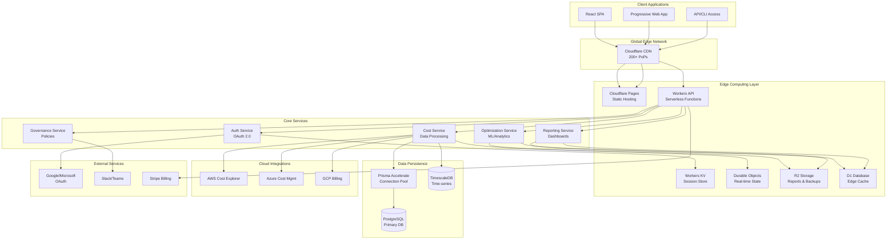

# PLANNING.md - FinOps Platform Strategic Planning Document

## Executive Summary

Building a cloud-native, multi-tenant FinOps platform leveraging Cloudflare's edge computing infrastructure to deliver real-time cloud cost management aligned with the FinOps Foundation Framework 2025. The platform will serve mid-market companies managing $50K-$5M in annual cloud spend, providing enterprise-grade capabilities without enterprise complexity.

**Project Codename**: CloudLens  
**Target Launch**: Q2 2026 (MVP in Q4 2025)  
**Framework Compliance**: FinOps Foundation Framework 2025 + FOCUS v1.2  
**Primary Tech Stack**: React + Cloudflare Workers + PostgreSQL  

---

## 1. Product Vision

### 1.1 Vision Statement
> "Democratize enterprise-grade FinOps capabilities for mid-market companies by delivering a platform that makes cloud cost optimization as intuitive as checking your bank account, as powerful as enterprise solutions, and as affordable as SaaS productivity tools."

### 1.2 Mission
Transform how mid-size organizations manage cloud costs by providing:
- **Real-time visibility** into multi-cloud spending
- **Actionable insights** aligned with business metrics
- **Automated optimization** without complexity
- **Cultural transformation** through collaborative tools

### 1.3 Strategic Goals

#### Year 1 Goals
- ✅ Launch MVP with AWS integration
- ✅ Achieve FOCUS v1.2 compliance
- ✅ Onboard 100+ paying customers
- ✅ Process $50M+ in cloud spend
- ✅ Deliver 15%+ average ESR (Effective Savings Rate)

#### Year 2 Goals
- 📈 Full multi-cloud support (AWS, Azure, GCP)
- 📈 AI-powered optimization recommendations
- 📈 500+ customers, $250M+ managed spend
- 📈 Expand to SaaS cost management (Cloud+)
- 📈 SOC 2 Type II certification

#### Year 3 Goals
- 🎯 Market leader in mid-market segment
- 🎯 $1B+ in managed cloud spend
- 🎯 Global presence with multi-region deployment
- 🎯 IPO readiness or strategic acquisition

### 1.4 Success Metrics

```yaml
Business Metrics:
  - Monthly Recurring Revenue (MRR): $200K by Y1
  - Customer Acquisition Cost (CAC): <$5,000
  - Customer Lifetime Value (CLV): >$100,000
  - Net Revenue Retention: >110%
  - Churn Rate: <5% annually

Product Metrics:
  - Average ESR achieved: >15%
  - Cost allocation coverage: >85%
  - Forecast accuracy: <12% variance
  - Time to first value: <7 days
  - Daily active usage: >60%

Technical Metrics:
  - API uptime: 99.9%
  - Dashboard load time: <2 seconds
  - Data freshness: <4 hours
  - Global latency: <100ms p95
  - Zero downtime deployments
```

---

## 2. Technical Architecture

### 2.1 High-Level Architecture



### 2.2 Architectural Principles

#### Edge-First Design
- **Compute at the edge**: Business logic in Workers (200+ global locations)
- **Data caching strategy**: Hot data in D1/KV, cold in PostgreSQL
- **Global performance**: <100ms latency worldwide
- **Zero cold starts**: Workers stay warm across requests

#### Serverless & Scalable
- **No infrastructure management**: Fully managed by Cloudflare
- **Auto-scaling**: Handle 0 to millions of requests
- **Pay-per-use**: Only pay for actual compute used
- **Infinite scale**: No practical upper limits

#### Security by Design
- **Zero Trust architecture**: Every request authenticated
- **Edge security**: Cloudflare WAF and DDoS protection
- **Encryption everywhere**: TLS 1.3, encrypted at rest
- **Principle of least privilege**: Granular RBAC

#### Data Architecture
```yaml
Hot Data (Edge):
  - User sessions (Workers KV)
  - Recent cost data (D1)
  - Cached dashboards (R2)
  - Real-time metrics (Durable Objects)

Warm Data (Accelerated):
  - 30-day cost history (Prisma Accelerate)
  - Active configurations (Cached)
  - Frequently accessed reports

Cold Data (PostgreSQL):
  - Historical data >30 days
  - Audit logs
  - Compliance records
  - Backups
```

### 2.3 Multi-Tenancy Strategy

```typescript
// Tenant Isolation Model
interface TenantIsolation {
  // Data Isolation
  database: 'shared_db_row_level_security';
  schema: 'tenant_id_on_every_table';
  
  // Compute Isolation  
  workers: 'shared_with_tenant_context';
  rateLimiting: 'per_tenant_quotas';
  
  // Storage Isolation
  r2Buckets: 'prefix_per_tenant';
  kvNamespaces: 'key_prefix_isolation';
  
  // Network Isolation
  customDomains: 'tenant.finops.app';
  apiKeys: 'tenant_scoped_tokens';
}
```

### 2.4 Service Architecture

#### Microservices Design
```yaml
Auth Service:
  - OAuth 2.0 flow management
  - JWT token generation/validation
  - RBAC enforcement
  - Session management
  - MFA support

Cost Service:
  - Cloud provider data ingestion
  - FOCUS normalization
  - Cost allocation engine
  - Anomaly detection
  - Data aggregation

Optimization Service:
  - ESR calculation
  - Rightsizing recommendations
  - RI/SP analysis
  - Waste identification
  - Savings tracking

Reporting Service:
  - Dashboard generation
  - Custom report builder
  - Data export (CSV/PDF)
  - Scheduled reports
  - Real-time updates

Governance Service:
  - Policy management
  - Budget tracking
  - Alert routing
  - Compliance reporting
  - Audit logging
```

---

## 3. Technology Stack

### 3.1 Frontend Stack

```yaml
Core Framework:
  React: 18.2+ (Latest stable)
  TypeScript: 5.3+ (Strict mode)
  Vite: 5.0+ (Build tool)

Styling & UI:
  Tailwind CSS: 3.4+ (Utility-first CSS)
  Tailwind UI: Component library
  HeadlessUI: Accessible components
  Heroicons: Icon set
  
State Management:
  Zustand: 4.4+ (Lightweight state)
  React Query: 5.0+ (Server state)
  
Data Visualization:
  D3.js: 7.8+ (Complex visualizations)
  Recharts: 2.10+ (Standard charts)
  Apache ECharts: 5.4+ (Advanced dashboards)
  Visx: Composable D3 components
  
Forms & Validation:
  React Hook Form: 7.48+
  Zod: 3.22+ (Schema validation)
  
Development Tools:
  ESLint: Code quality
  Prettier: Code formatting
  Vitest: Unit testing
  Playwright: E2E testing
  Storybook: Component development
```

### 3.2 Backend Stack

```yaml
Runtime & Framework:
  Cloudflare Workers: Edge compute
  Hono: 3.0+ (Web framework for Workers)
  
Database & ORM:
  PostgreSQL: 15+ (Primary database)
  Prisma: 5.0+ (Type-safe ORM)
  Prisma Accelerate: Connection pooling
  
Edge Storage:
  Workers KV: Key-value store
  R2: Object storage
  D1: SQLite at the edge
  Durable Objects: Stateful workers
  
Authentication:
  Jose: JWT handling in Workers
  Web Crypto API: Native crypto
  
API Design:
  REST: Primary API style
  GraphQL: Complex queries (optional)
  tRPC: Type-safe APIs
  
Data Processing:
  Apache Arrow: Columnar data
  DuckDB WASM: In-browser analytics
```

### 3.3 Infrastructure & DevOps

```yaml
Deployment Platform:
  Cloudflare Pages: Frontend hosting
  Cloudflare Workers: Backend compute
  Wrangler: CLI deployment tool
  
Database Hosting:
  Neon: Serverless PostgreSQL
  # Alternative: Supabase, PlanetScale
  
CI/CD Pipeline:
  GitHub Actions: Primary CI/CD
  Cloudflare Pages: Auto-deploy
  
Monitoring & Observability:
  Cloudflare Analytics: Built-in metrics
  Sentry: Error tracking
  LogDNA: Log aggregation
  # Alternative: Datadog
  
Testing Infrastructure:
  Vitest: Unit tests
  Playwright: E2E tests
  MSW: API mocking
  Faker.js: Test data generation
  
Security & Compliance:
  Cloudflare WAF: Web application firewall
  Cloudflare Access: Zero Trust
  1Password: Secrets management
  Snyk: Dependency scanning
```

### 3.4 Development Stack

```yaml
IDE & Extensions:
  VS Code: Primary IDE
  GitHub Copilot: AI assistance
  Prettier: Code formatting
  ESLint: Linting
  
Version Control:
  Git: Source control
  GitHub: Repository hosting
  Conventional Commits: Commit standards
  
Package Management:
  pnpm: Fast, disk-efficient
  Turborepo: Monorepo management
  
Documentation:
  Mintlify: API documentation
  Docusaurus: Product docs
  Mermaid: Diagrams
  
Collaboration:
  Linear: Issue tracking
  Slack: Team communication
  Figma: Design collaboration
  Notion: Knowledge base
```

---

## 4. Required Tools & Services

### 4.1 Development Environment

```bash
# Core Development Tools
- Node.js 20+ LTS
- pnpm 8+ (package manager)
- Git 2.40+
- VS Code (latest)
- Wrangler CLI 3+ (Cloudflare)
- Prisma CLI 5+
- PostgreSQL 15+ (local)
- Docker Desktop (optional)

# VS Code Extensions (Required)
- Prisma
- Tailwind CSS IntelliSense
- ESLint
- Prettier
- TypeScript Vue Plugin
- GitLens
- Thunder Client (API testing)
- Cloudflare Workers

# Browser Extensions
- React Developer Tools
- Cloudflare Workers Developer Tools
- WAVE (accessibility)
```

### 4.2 Cloud Services & Accounts

```yaml
Essential Services (Day 1):
  Cloudflare:
    - Workers Paid Plan: $5/month
    - R2 Storage: $0.015/GB/month
    - D1 Database: Free tier initially
    - Pages: Free for team
    
  Database:
    - Neon: $19/month starter
    # Alternative: Supabase ($25/month)
    
  Authentication:
    - Google Cloud Console: OAuth setup (free)
    - Microsoft Azure AD: App registration (free)
    
  Payments:
    - Stripe: 2.9% + 30¢ per transaction
    
  Domain & Email:
    - Domain registration: ~$15/year
    - Google Workspace: $6/user/month

Development Tools:
  GitHub:
    - Team Plan: $4/user/month
    - Actions: 2,000 minutes free
    
  Monitoring:
    - Sentry: $26/month team plan
    - LogDNA: $30/month starter
    
  Design:
    - Figma: $15/user/month
    - Tailwind UI: $299 one-time

Testing Services:
  - BrowserStack: $39/month
  - Postman: Free tier
  - Mailtrap: Email testing free tier
```

### 4.3 Third-Party APIs

```yaml
Cloud Provider APIs (Required):
  AWS:
    - Cost Explorer API
    - Organizations API
    - IAM for cross-account
    
  Azure:
    - Cost Management API
    - Consumption API
    - Azure AD for auth
    
  GCP:
    - Cloud Billing API
    - Resource Manager API
    - IAM for service accounts

Integration APIs (Optional):
  Slack:
    - Incoming webhooks
    - Slack App (OAuth)
    
  Microsoft Teams:
    - Incoming webhooks
    - Graph API
    
  Jira:
    - REST API
    - Webhooks
    
  ServiceNow:
    - REST API
    - OAuth 2.0
```

### 4.4 Development Tools Setup

```bash
# 1. Install Node.js and pnpm
curl -fsSL https://get.pnpm.io/install.sh | sh -
pnpm env use --global 20

# 2. Install Cloudflare Wrangler
pnpm install -g wrangler
wrangler login

# 3. Install Prisma CLI
pnpm install -g prisma

# 4. Setup PostgreSQL (Mac)
brew install postgresql@15
brew services start postgresql@15

# 5. Create project structure
mkdir finops-platform && cd finops-platform
pnpm init
pnpm create vite@latest frontend -- --template react-ts
mkdir backend workers shared

# 6. Initialize monorepo
pnpm add -D turborepo
cat > turbo.json << EOF
{
  "pipeline": {
    "build": {
      "dependsOn": ["^build"],
      "outputs": ["dist/**"]
    },
    "dev": {
      "persistent": true
    },
    "test": {},
    "lint": {}
  }
}
EOF

# 7. Setup Prisma
cd backend
pnpm init
pnpm add -D prisma @prisma/client
prisma init --datasource-provider postgresql

# 8. Configure Wrangler
wrangler init workers
```

### 4.5 Local Development Environment

```yaml
# docker-compose.yml
version: '3.8'

services:
  postgres:
    image: postgres:15-alpine
    environment:
      POSTGRES_USER: finops
      POSTGRES_PASSWORD: finops_dev
      POSTGRES_DB: finops_platform
    ports:
      - "5432:5432"
    volumes:
      - postgres_data:/var/lib/postgresql/data
      
  redis:
    image: redis:7-alpine
    ports:
      - "6379:6379"
      
  mailhog:
    image: mailhog/mailhog
    ports:
      - "1025:1025"  # SMTP
      - "8025:8025"  # Web UI

volumes:
  postgres_data:
```

---

## 5. Implementation Roadmap

### 5.1 Phase 1: Foundation (Months 1-3)

```yaml
Month 1 - Core Infrastructure:
  Week 1-2:
    - Set up GitHub repository
    - Configure CI/CD pipeline
    - Initialize monorepo structure
    - Set up Cloudflare account
    
  Week 3-4:
    - Implement authentication (OAuth)
    - Create database schema
    - Build tenant management
    - Deploy to staging

Month 2 - Data Pipeline:
  Week 5-6:
    - AWS Cost Explorer integration
    - FOCUS data normalization
    - Cost ingestion pipeline
    - Basic allocation engine
    
  Week 7-8:
    - Workers KV session management
    - API rate limiting
    - Error handling
    - Monitoring setup

Month 3 - Core Features:
  Week 9-10:
    - Dashboard framework
    - Cost trend visualization
    - Basic reporting
    - CSV export
    
  Week 11-12:
    - Budget management
    - Alert system
    - Email notifications
    - Beta deployment
```

### 5.2 Phase 2: FinOps Capabilities (Months 4-6)

```yaml
Month 4 - Optimization:
  - ESR calculation
  - Rightsizing recommendations
  - RI/SP analysis
  - Waste identification

Month 5 - Governance:
  - Policy engine
  - Tag enforcement
  - Compliance reporting
  - Audit logging

Month 6 - Advanced Features:
  - Anomaly detection
  - Forecasting
  - Unit economics
  - Custom dashboards
```

### 5.3 Phase 3: Multi-Cloud & Scale (Months 7-9)

```yaml
Month 7 - Azure Integration:
  - Azure Cost Management API
  - Cross-cloud normalization
  - Unified dashboards

Month 8 - GCP Integration:
  - GCP Billing API
  - Complete multi-cloud
  - Performance optimization

Month 9 - Enterprise Features:
  - SSO/SAML
  - API access
  - White labeling
  - Advanced RBAC
```

---

## 6. Security & Compliance

### 6.1 Security Architecture

```yaml
Authentication & Authorization:
  - OAuth 2.0 with PKCE
  - JWT tokens (RS256)
  - MFA support
  - Session timeout (24h)
  - API key management

Data Protection:
  - TLS 1.3 everywhere
  - AES-256 encryption at rest
  - Field-level encryption for credentials
  - Key rotation every 90 days
  - Secure credential storage

Network Security:
  - Cloudflare WAF
  - DDoS protection
  - Rate limiting per tenant
  - IP allowlisting (optional)
  - Zero Trust architecture

Application Security:
  - OWASP Top 10 compliance
  - Content Security Policy
  - XSS protection
  - SQL injection prevention
  - Dependency scanning
```

### 6.2 Compliance Requirements

```yaml
Certifications Target:
  Year 1:
    - SOC 2 Type I
    - GDPR compliance
    - CCPA compliance
    
  Year 2:
    - SOC 2 Type II
    - ISO 27001
    - HIPAA (optional)

Data Residency:
  - Multi-region support
  - Data localization options
  - GDPR-compliant processing
  - Right to deletion

Audit & Logging:
  - Comprehensive audit logs
  - 90-day retention minimum
  - Immutable log storage
  - SIEM integration ready
```

---

## 7. Performance & Scalability

### 7.1 Performance Targets

```yaml
Response Times:
  - API: <200ms p95
  - Dashboard: <2s initial load
  - Subsequent nav: <500ms
  - Report generation: <10s
  - Data refresh: <5 minutes

Throughput:
  - 10,000 requests/second
  - 1TB daily data processing
  - 100,000 concurrent users
  - 1 million API calls/day

Availability:
  - 99.9% uptime SLA
  - <43.2 minutes downtime/month
  - Zero-downtime deployments
  - Automatic failover
```

### 7.2 Scalability Strategy

```yaml
Horizontal Scaling:
  - Workers: Auto-scale globally
  - Database: Read replicas
  - Cache: Distributed KV
  - Storage: Unlimited R2

Vertical Scaling:
  - Database: Auto-scale compute
  - Workers: 128MB memory limit
  - Burst capacity: 10x baseline

Data Partitioning:
  - Tenant-based sharding
  - Time-series partitioning
  - Hot/warm/cold tiers
  - Archive after 13 months
```

---

## 8. Cost Projections

### 8.1 Infrastructure Costs (Monthly)

```yaml
Development Environment:
  - Cloudflare Workers: $5
  - Neon Database: $19
  - GitHub Team: $20
  - Domain/Email: $50
  - Total: ~$100/month

Production (100 customers):
  - Cloudflare Workers: $200
  - Database (Neon Pro): $100
  - R2 Storage: $50
  - Monitoring: $60
  - Total: ~$500/month

Scale (1000 customers):
  - Cloudflare Workers: $1,500
  - Database (Dedicated): $500
  - R2 Storage: $200
  - Monitoring: $200
  - CDN/Security: $500
  - Total: ~$3,000/month
```

### 8.2 Team & Operations

```yaml
Initial Team (6-8 people):
  - Technical Lead: $150k
  - Backend Engineers (2): $260k
  - Frontend Engineers (2): $240k
  - DevOps Engineer: $130k
  - Product Manager: $140k
  - UI/UX Designer: $110k
  - Total: ~$1M/year

Tools & Services:
  - Development tools: $500/month
  - SaaS subscriptions: $1,000/month
  - Cloud credits: $2,000/month
  - Total: ~$40k/year

Marketing & Sales:
  - Content marketing: $3k/month
  - Paid ads: $5k/month
  - Conferences: $50k/year
  - Total: ~$150k/year
```

---

## 9. Risk Management

### 9.1 Technical Risks

```yaml
High Priority:
  - Cloud provider API changes
    Mitigation: Abstraction layer, versioning
    
  - Data accuracy issues
    Mitigation: Reconciliation, validation
    
  - Scalability bottlenecks
    Mitigation: Load testing, auto-scaling

Medium Priority:
  - Vendor lock-in (Cloudflare)
    Mitigation: Portable architecture
    
  - Security breaches
    Mitigation: Security audits, pen testing
    
  - Performance degradation
    Mitigation: Monitoring, optimization

Low Priority:
  - Technology obsolescence
    Mitigation: Regular updates, refactoring
    
  - Integration failures
    Mitigation: Retry logic, circuit breakers
```

### 9.2 Business Risks

```yaml
Market Risks:
  - Competition from incumbents
  - Economic downturn
  - Cloud adoption slowdown

Operational Risks:
  - Key person dependency
  - Customer churn
  - Support overwhelm

Financial Risks:
  - Runway exhaustion
  - CAC > LTV
  - Price pressure
```

---

## 10. Success Criteria & KPIs

### 10.1 Product Success Metrics

```yaml
Adoption Metrics:
  - Time to first value: <7 days
  - Feature adoption rate: >60%
  - Daily active users: >50%
  - API usage growth: 20% MoM

Quality Metrics:
  - Customer satisfaction: >4.5/5
  - NPS score: >40
  - Support tickets: <5% of MAU
  - Bug escape rate: <5%

Business Impact:
  - Average ESR delivered: >15%
  - Cost allocation coverage: >85%
  - Forecast accuracy: <12% variance
  - Customer ROI: >3x subscription cost
```

### 10.2 Technical Success Metrics

```yaml
Performance:
  - API uptime: 99.9%
  - Response time: <200ms p95
  - Error rate: <0.1%
  - Deployment frequency: Daily

Scale:
  - Customers supported: 1,000+
  - Data processed: 1TB+ daily
  - Concurrent users: 10,000+
  - API calls: 1M+ daily

Quality:
  - Test coverage: >80%
  - Tech debt ratio: <20%
  - Security score: A+
  - Lighthouse score: >90
```

---

## 11. Appendices

### A. Technology Decision Records

```yaml
ADR-001: Choose Cloudflare Workers
  Status: Accepted
  Context: Need global, serverless compute
  Decision: Use Workers for edge computing
  Consequences: Vendor lock-in, but superior performance

ADR-002: PostgreSQL over NoSQL
  Status: Accepted
  Context: Need ACID, complex queries
  Decision: PostgreSQL with Prisma
  Consequences: Schema migrations, but data integrity

ADR-003: React over Vue/Svelte
  Status: Accepted
  Context: Team expertise, ecosystem
  Decision: React with TypeScript
  Consequences: Larger bundle, but better talent pool
```

### B. Glossary

```yaml
Technical Terms:
  - ESR: Effective Savings Rate
  - FOCUS: FinOps Open Cost & Usage Specification
  - RI: Reserved Instances
  - SP: Savings Plans
  - CUD: Committed Use Discounts
  - CAC: Customer Acquisition Cost
  - LTV: Lifetime Value
  - MRR: Monthly Recurring Revenue
  - ARR: Annual Recurring Revenue

Architecture Terms:
  - Edge Computing: Compute at CDN locations
  - Durable Objects: Stateful serverless
  - Workers KV: Key-value storage
  - R2: Object storage (S3 compatible)
  - D1: SQLite at the edge
```

### C. Resources & References

```yaml
Documentation:
  - FinOps Foundation: https://finops.org
  - FOCUS Spec: https://focus.finops.org
  - Cloudflare Docs: https://developers.cloudflare.com
  - Prisma Docs: https://prisma.io/docs

Communities:
  - FinOps Slack: finops.slack.com
  - Cloudflare Discord: discord.gg/cloudflaredev
  - React Discord: discord.gg/react

Learning Resources:
  - FinOps Certified Practitioner
  - Cloudflare TV
  - Epic React by Kent C. Dodds
  - Testing JavaScript
```

---

## Document Control

**Version**: 1.0  
**Last Updated**: September 30, 2025  
**Next Review**: October 31, 2025  
**Owner**: Product & Engineering Team  
**Status**: Living Document

### Revision History
| Version | Date | Author | Changes |
|---------|------|--------|---------|
| 1.0 | 2025-09-30 | Team | Initial planning document |

---

*This is a living document. Updates should be made as the project evolves and new decisions are made.*
